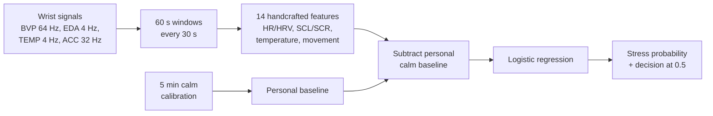

[](https://github.com/bhargavimahesh/wearable-affect/actions/workflows/ci.yml)

# wearable-affect

**Personalised stress detection from wrist-worn wearable signals, from evaluation to a containerised, CI-tested API.**

Using the public [WESAD](https://ubicomp.eti.uni-siegen.de/home/datasets/icmi18/) dataset (Empatica E4 wrist sensor, 15 participants), this project builds a stress detector that is evaluated on people it has never seen, personalised with five minutes of calm data from each new user, checked for probability calibration, and served through a stateless HTTP API in a Docker container that GitHub Actions builds and smoke-tests on every push.

The focus is on **honest evaluation**: leave-one-subject-out testing, per-person results instead of averages alone, success criteria written down before experiments, and negative results reported as such.

> Research and portfolio project. Not a medical device; not for diagnosis or clinical decisions. See the [model card](MODEL_CARD.md).

---

## Results at a glance

All numbers are leave-one-subject-out (LOSO): every prediction comes from a model that never saw that person. Mean ± standard deviation across the 15 subjects.

**Generic models** (all windows):

| Model | Macro F1 | Balanced accuracy | AUROC |
|---|---|---|---|
| Majority class (always "no stress") | 0.41 ± 0.00 | 0.50 ± 0.00 | 0.50 ± 0.00 |
| Logistic regression | 0.83 ± 0.11 | 0.85 ± 0.10 | 0.97 ± 0.05 |
| LightGBM | 0.85 ± 0.14 | 0.87 ± 0.12 | 0.98 ± 0.04 |

**Personalised model (deployed)**: features expressed relative to each person's calm baseline, measured from the first 5 minutes of their recording. Generic and personalised models are scored on exactly the same windows (calibration minutes excluded):

| Logistic regression | Macro F1 | AUROC |
|---|---|---|
| Generic | 0.839 | 0.966 |
| **Personalised (5 min calibration)** | **0.896** | 0.971 |

Personalisation improved F1 for 9 subjects, worsened it for 5, and left 1 unchanged. It fixes person-specific *offsets* rather than ranking, which is why AUROC barely moves. The deployed configuration was selected among 12 variants on the same 15 subjects, so its score is somewhat optimistic.

## Key findings

**1. The generic model ranks stress well for everyone, but probabilities are shifted per person.** AUROC was ≥ 0.86 for every subject, yet F1 varied widely: for one participant (S14), AUROC was 0.91 while F1 was 0.42, because all their probabilities fell below 0.5. The best per-person threshold ranged from 0.05 to 0.95 across subjects. This is what motivated personalisation.

**2. Baseline normalisation works; calm-based personal thresholds do not.** Subtracting each person's calm baseline raised mean F1 in all 6 model × calibration-length combinations. Setting a personal decision threshold from the same calm minutes made results worse in all 12 comparisons: quiet sitting does not represent all non-stress states (amusement is also arousing), so the threshold ends up too low.

**3. A library default reversed a physiological effect.** NeuroKit2's default skin-conductance-response (SCR) detector uses a threshold *relative* to the largest peak in a window. In calm windows, sensor noise was counted as responses (~40/min), so calm windows appeared to have more responses than stressed ones. An absolute 0.01 µS threshold fixed it (~7/min calm vs ~20/min stress). Caught by checking features against physiology before modelling; a regression test now guards it.

**4. Labels hold up, but physiology and self-report dissociate.** All 15 participants reported higher arousal after the stress task than after baseline (manipulation check, criterion fixed in advance). Yet self-reported arousal change was unrelated to skin-conductance change (Spearman ρ = 0.09) or to how detectable a person's stress was (ρ = 0.18); with n = 15, only strong correlations would be detectable. One participant reported the strongest stress of all while their skin conductance *fell*; another reported strong stress with almost no electrodermal response.

**5. A PPG foundation model did not help here.** Replacing handcrafted heart-rate features with [PaPaGei-S](https://github.com/Nokia-Bell-Labs/papagei-foundation-model) embeddings did not improve the model: the mean F1 gain came almost entirely from two subjects and reflected threshold effects, while within-person ranking (AUROC) got worse for 8 of 11 non-tied subjects (sign test p ≈ 0.23). Likely cause: PaPaGei was pretrained on clinical PPG, a domain shift from wrist PPG. WESAD is not in its pretraining data.

**6. The deployed model's probabilities are trustworthy on average.** Logistic regression is well calibrated (Brier score 0.076 vs 0.225 for always predicting the base rate). LightGBM had a similar Brier score but was confidently wrong at the low end (windows predicted ~6% stress were 41% stress), one reason logistic regression was deployed.

Details, numbers and caveats: [FINDINGS.md](FINDINGS.md). Every design choice and its reasoning: [DECISIONS.md](DECISIONS.md).

## How it works



- **Task**: binary stress (TSST condition) vs non-stress (baseline + amusement), on 60 s windows with a 30 s step; only windows lying entirely within one condition are used (1,015 windows, 30% stress).
- **Features**: heart rate and HRV from PPG (NeuroKit2, Elgendi peak detection); tonic level and phasic responses from EDA (smooth-median decomposition, absolute SCR threshold); skin-temperature level and trend; movement intensity.
- **Evaluation**: leave-one-subject-out; macro F1 (primary), balanced accuracy and AUROC, reported per subject and as mean ± SD.
- **Training/serving parity**: the same feature function is used for training and serving, and a test runs one recording through both paths and requires identical probabilities.

## The API

A stateless FastAPI service: it stores nothing about users. The client keeps its baseline and sends it with each prediction.

| Endpoint | Purpose |
|---|---|
| `GET /health` | Liveness check and model metadata |
| `POST /calibrate` | 1–15 min of calm signals (5 min recommended) → personal baseline |
| `POST /predict` | One 60 s window + baseline → stress probability, decision, and any features that couldn't be computed (e.g. heart features when the pulse signal is flat) |

Input is validated at the boundary (all four signals present, finite, and of equal duration). Interactive documentation is generated at `/docs`.

Measured: predictions over HTTP match direct use of the detector (max difference 2.4 × 10⁻⁶); single-request latency 114 ms in the container (synthetic signals).

## Engineering

- **Package** (`src/wearable_affect`) with 36 automated tests, including the training/serving parity test and tests that pin down bugs found during development
- **Experiment tracking** with MLflow: every run logs parameters, metrics, per-subject results, window-level predictions and the Git commit
- **Docker image** with runtime dependencies only (no PyTorch, no LightGBM, no dev tools), running as a non-root user: 280 MB compressed
- **CI** (GitHub Actions) on every push: tests on a clean machine, then image build, container start and smoke test. CI uses a stand-in model trained on synthetic data, because the real model is derived from WESAD and is not stored in GitHub.

## Repository layout

```
src/wearable_affect/   data loading, windowing, features, evaluation, personalisation,
                       detector, API, MLflow tracking, PaPaGei adapter
  third_party/         PaPaGei-S model architecture (vendored, BSD-3-Clause-Clear)
tests/                 pytest suite
scripts/               API smoke test, CI stand-in model
notebooks/             exploration and experiments, numbered in reading order
Dockerfile             serving image
.github/workflows/     CI
DECISIONS.md           design decisions with reasons and alternatives
FINDINGS.md            results and analyses
MODEL_CARD.md          intended use, data, evaluation, limitations
```

## Running it yourself

Requires Python 3.11 and [uv](https://docs.astral.sh/uv/).

```bash
git clone https://github.com/bhargavimahesh/wearable-affect.git
cd wearable-affect
uv sync --no-group fm      # omit --no-group fm to also install PyTorch for the PaPaGei experiments
uv run pytest
```

**Data.** WESAD is not included (its licence does not allow redistribution). Request it from the [WESAD page](https://ubicomp.eti.uni-siegen.de/home/datasets/icmi18/) and unzip it so that `data/raw/WESAD/S2/S2.pkl` exists. The notebooks then reproduce the analyses in order; the final-detector notebook trains and saves the deployed model to `artifacts/stress_detector.joblib`.

**PaPaGei weights** (only for the foundation-model experiments): download `papagei_s.pt` from [Zenodo](https://zenodo.org/records/13983110) into `weights/`.

**Run the API locally:**

```bash
uv run uvicorn wearable_affect.api:create_app --factory --port 8080
```

**Or in Docker:**

```bash
docker build -t wearable-affect .
docker run --rm -p 8080:8080 wearable-affect
uv run --no-group fm python scripts/smoke_test_api.py http://127.0.0.1:8080
```

## Limitations

- **15 participants, one lab session each.** Too few for strong statistical claims; most per-subject comparisons are not significant on their own.
- **Same-session calibration.** The baseline comes from the start of the same recording that is evaluated. Real baselines drift across hours and days, which WESAD cannot test.
- **Unrepresentative first minutes.** Personalisation made results worse for 5 subjects, plausibly because the minutes right after putting on a sensor are not representative (electrode settling).
- **Lab stressor, one device.** A standardised stress test and an Empatica E4; transfer to daily life or other wearables is untested.
- **Labels are conditions, not experiences.** "Stress" means the participant was in the stress condition; self-reports confirm the manipulation worked, but individual experience varies.

## Acknowledgements and references

- Schmidt, P., Reiss, A., Duerichen, R., Marberger, C., & Van Laerhoven, K. (2018). Introducing WESAD, a multimodal dataset for wearable stress and affect detection. *ICMI 2018*.
- Makowski, D., et al. (2021). NeuroKit2: A Python toolbox for neurophysiological signal processing. *Behavior Research Methods*.
- Pillai, A., Spathis, D., Kawsar, F., & Malekzadeh, M. (2025). PaPaGei: Open foundation models for optical physiological signals. *ICLR 2025*.

## License

Code: MIT (see [LICENSE](LICENSE)). The vendored PaPaGei architecture in
`src/wearable_affect/third_party/` is BSD-3-Clause-Clear (see its licence file there).
WESAD and models derived from it are not included and are subject to WESAD's own terms.